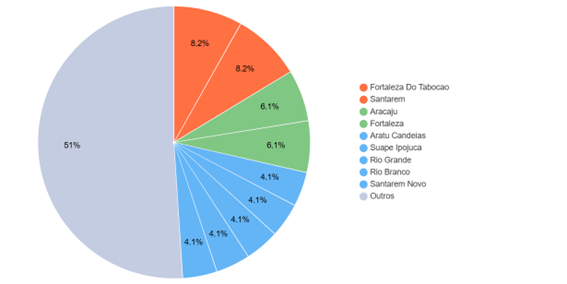
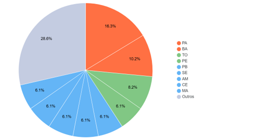
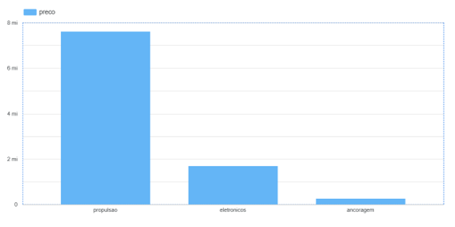

# Relatório de Análise de Dados: LH Nautical
**Desafio Lighthouse** | *Luiz Rangel Cardoso Teixeira Aguiar* | **2026**

---

## 1. Introdução
Este relatório apresenta uma análise estratégica da base de dados da empresa **LH Nautical**. O objetivo principal é demonstrar a capacidade de atuação em toda a jornada de dados, desde o tratamento de informações brutas até a geração de insights que apoiem a tomada de decisões estratégicas.

O projeto simula um cenário real de desorganização de dados, ausência de integração entre sistemas e dificuldades na consolidação de informações operacionais e financeiras.

### Competências Aplicadas:
* **EDA:** Análise exploratória de dados.
* **Data Cleaning:** Limpeza e transformação de dados inconsistentes.
* **SQL:** Consultas estruturadas para métricas de negócio.
* **Business Intelligence:** Análises orientadas ao ROI e performance.

---

## 2. Análise Inicial dos Dados
A base contém informações consolidadas de:
* **Clientes** (Localização e identificação)
* **Produtos** (Categorização e precificação)
* **Custos de Importação** (Logística internacional)
* **Vendas** (Histórico de 2023 e 2024)

### Principais Desafios Encontrados:
> [!IMPORTANT]
> Foram identificados dados aninhados (JSON/Lists), formatos de data inconsistentes, valores nulos e falta de padronização nas nomenclaturas.

---

## 3. Pipeline de Tratamento
A etapa de ETL (Extração, Transformação e Carga) focou em:
1.  **Remoção de Nulos:** Tratamento de lacunas que distorciam as médias.
2.  **Padronização:** Uniformização de strings e unidades monetárias.
3.  **Normalização (Explode):** Expansão de estruturas aninhadas para tabelas relacionais.
4.  **Consistência:** Garantia de integridade entre as tabelas de suporte.

---

## 4. Análises e Resultados

### Distribuição Geográfica de Clientes
| Estado | Quantidade de Clientes |
| :--- | :---: |
| **Pará** | 8 |
| **Bahia** | 5 |
| **Tocantins** | 4 |
### Gráfico com porcentagem de clientes por cidade:

### Gráfico com porcentagem de clientes por estado:

> **Insight:** Foco estratégico em regiões com maior concentração (Norte/Nordeste) para otimização logística.

### Preço Médio por Categoria
| Categoria | Preço Médio (R$) |
| :--- | :--- |
| **Propulsão** | R$ 7.607.461,34 |
| **Eletrônicos** | R$ 1.688.000,58 |
| **Ancoragem** | R$ 252.285,12 |
### Gráfico com preço médio por categoria:

---

## 5. Detalhamento de Produtos

### Top 3 Produtos Mais Caros
1. **Motor Diesel Honda Aero 205Hp** — R$ 14.819.823,00
2. **Motor Torqeedo Core Hydra Flux** — R$ 14.315.993,00
3. **Motor Torqeedo Ion Orca Vox** — R$ 13.995.767,00

### Destaque por Categoria (O mais caro de cada)
* **Ancoragem:** Âncora Delta Force Barracuda — R$ 478.556,00
* **Eletrônicos:** Transponder Furuno — R$ 3.945.286,00
* **Propulsão:** Motor Diesel Honda — R$ 14.819.823,00

---

## 6. Desempenho Financeiro

### Receita Total por Categoria
* **Propulsão:** R$ 2.076.274.140,85
* **Eletrônicos:** R$ 464.173.617,80
* **Ancoragem:** R$ 69.831.752,05

### Faturamento Anual
| Ano | Faturamento Total (R$) | Status |
| :--- | :--- | :--- |
| **2023** | R$ 1.288.827.294,55 | Estável |
| **2024** | R$ 1.321.452.216,15 | Crescimento |

---

## Ferramentas Utilizadas
* **Linguagem:** Python (Pandas, NumPy, Matplotlib, Seaborn)
* **Banco de Dados:** SQL (SQLite)
* **Ambiente:** Jupyter Notebook / Git / GitHub
* **Visualização:** Looker Studio

